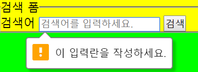

# css

## box-sizing속성

-  box-sizing: content-box;
  - content-box는 width + border + padding 값 모두 더해진다.


-  box-sizing: border-box
  - border-box는 width값으로 정해지고 padding을 줘도 width값은 늘어나질않는다.

## 레이아웃

1. 높이는 auto로 설정하여 컨텐츠에 따라 자연스럽게 늘어나게 하는 것이 좋다.

2. 배치 조정 방법
   1. `float`: 구형 브라우저까지 고려
   2. `flexbox`: 모던 브라우저에 맞출 때 사용
   3. `grid`: 모던 브라우저에 맞출 때 사용
   4. 레이아웃 구성 시 헷갈리지 않도록 `box-sizing: border-box`로 설정한다.

   ## flex

   1. `display: flex`: 해당 요소 안의 모든 자식요소가 flex item으로 변경된다. 모든 자식 요소들은 order 값을 가질수있다. (order0,order1) 
   2. 모바일 웹 개발 시 box-sizing은 content-box보다 border-box가 더 유리하다.


## form태그

`form` 태그는 정보를 전달 해야 할때 필요하다.  

`form`태그 안에 `fieldset `을 자식요소로 만들고 그안에 `legend` 를만든다.

```
form.search>fieldset>legend 3개가 셋트다
```

`fieldset` 연관성있는 내용들을 감싸주는 태그이다.

`legend`는 `fieldset`의 내용을 명시하는 역할이다.

`input`을 쓸때 `label`은 항상 있어야한다.

`label`의 for "" 는 input에 id 를 읽어옴으로써 두요소를 묶는다.   

```
<form action="javascript:alert('검색이 완료되었습니다.');" class="search">
     <fieldset>
        <legend>검색 폼</legend>
        <label for="search">검색어</label>
        <input type="search" id="search" required placeholder="검색어를 입력하세요.">
        <button type="submit" class="btn-search">검색</button>
     </fieldset> 
</form>
```

`required`는 이 입력 상자는 필수라는 뜻이다.



`placeholder` input 태그 안에 글씨를 입력할수있다.

```
<input type="search" id="search" required placeholder="검색어를 입력하세요.">
```


